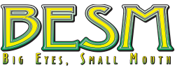

# BESM 2nd Edition — Character Creator



A standalone desktop character creation tool for **Big Eyes, Small Mouth Retro 2nd Edition**, built with Python and Tkinter. No installation required — just download and run.

---

## Features

- Multi-character tabs — manage several characters at once
- Character Points (CP) and Skill Points (SP) tracking with live cost calculation
- Full Attributes, Defects, and Weapons editor with Advantages/Defects per weapon
- Mecha editor with MP budget tracking
- PDF character sheet export (via ReportLab)
- Arsenal window — a reusable weapon library you can copy into any character
- Multi-language support via TOML configuration files
- Save/load characters as JSON

---

## Download & Run

### End Users (no Python required)

1. Go to the [Releases](../../releases) page
2. Download the executable for your operating system:
   - `BESM2nd_CharGen.exe` — Windows
   - `BESM2nd_CharGen` — Linux
3. Place the executable in a folder of your choice
4. Run it — on first launch, a setup dialog will ask which language(s) to install

The app will create the following folders next to the executable:

```
BESM2nd Config/       ← language TOML files (editable)
BESM2nd Characters/   ← your saved characters (JSON)
BESM2nd Arsenal/      ← your saved weapon arsenals (JSON)
BESM2nd Mecha/        ← your saved mecha (JSON)
```

### Developers (running from source)

**Requirements:** Python 3.11+

```bash
# Clone the repository
git clone https://github.com/Cornebre/BESM2nd-CharGen.git
cd BESM2nd-CharGen

# Run directly
python BESM2nd_CharGen.py
```

For PDF export, install ReportLab:

```bash
pip install reportlab
```

---

## Language / Translation Files

Language files are TOML files named `besm2nd_config_XXX.toml` where `XXX` is a language code (e.g. `eng`, `fra`).

On first run, the app detects all bundled language files and lets you choose which to install. The selected files are copied to the `BESM2nd Config/` folder next to the executable, where you can edit them freely.

**Currently bundled languages:**
- English (`besm2nd_config_eng.toml`)
- French (`besm2nd_config_fra.toml`)

Want to add a new language or fix a translation? See [CONTRIBUTING.md](CONTRIBUTING.md).

---

## Building from Source

Install PyInstaller, then run:

```bash
pip install pyinstaller
pyinstaller --onefile \
  --add-data "besm2nd_config_eng.toml:." \
  --add-data "besm2nd_config_fra.toml:." \
  --add-data "BESM2nd_Native_Arsenal.json:." \
  --add-data "BESM2_Retro_logo_dtrpg_250px.png:." \
  BESM2nd_CharGen.py
```

The executable will be in the `dist/` folder. **Note:** you must build separately on each OS you want to support.

---

## Project Structure

```
BESM2nd_CharGen.py              ← main application
besm2nd_config_eng.toml         ← English configuration & translations
besm2nd_config_fra.toml         ← French configuration & translations
BESM2nd_Native_Arsenal.json     ← default weapon arsenal (bundled)
BESM2_Retro_logo_dtrpg_250px.png ← app logo
```

---

## License

This project is licensed under the **MIT License** — see [LICENSE](LICENSE) for details.

*BESM (Big Eyes, Small Mouth) and its logo are a trademark of Dyskami Publishing Company. This tool is a fan-made utility and is not affiliated with or endorsed by Dyskami Publishing.*

---

## Credits

**Creator:** Cornebre  
**Assisted by:** [claude.ai](https://claude.ai)
